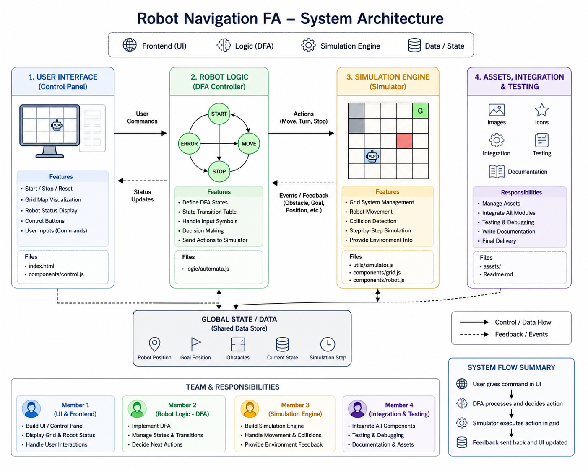

# 🤖 Robot Navigation Using Finite Automata

<div align="center">
  
  
  
  
  
</div>


A robot navigation project that validates and simulates command sequences using a Finite Automaton (DFA or NFA). The robot runs on an 8×8 grid and must follow a formally defined command language whose constraints are enforced by the automaton.

## 🎯 Objectives

- Define a formal command language for robot navigation
- Model the language with a Finite Automaton and validate sequences
- Simulate robot movement visually after validation

## 👥 Member Team12

| Name          |        Id |
| ------------- | --------: |
| KHORN Victor  | e20230078 |
| PEN Bunnaka   | e20230757 |
| THEA Rosa     | e20230854 |
| PAK Siphaneth | e20231021 |

<table>
	<tr>
		<td><strong>Task</strong><br /><a href="https://trello.com/invite/b/69f83fdb64407b086d57fa0c/ATTI4bc0627b90858107a06cc462f37084fa5C1BB74C/automata">Open Trello board</a></td>
	</tr>
</table>

## ⚙️ Robot Specifications

| Property          |              Value |
| ----------------- | -----------------: |
| Grid size         |              8 × 8 |
| Start position    |             (0, 0) |
| Initial direction |              North |
| Maximum energy    |            5 units |
| Energy cost       | 1 per move or turn |

## 🔤 Command Language (Alphabet)

| Command | Description     |
| ------- | --------------- |
| START   | Begin sequence  |
| STOP    | End sequence    |
| F       | Move forward    |
| B       | Move backward   |
| L       | Turn left       |
| R       | Turn right      |
| P       | Pick object     |
| D       | Drop object     |
| C       | Recharge energy |

## 📏 Rules & Constraints

### 🧱 Structure

- Sequences must start with `START` and end with `STOP`.
- Must include at least one movement command (`F` or `B`).

### 🛠️ Tasks

- Must complete at least two pick–drop tasks (`P` then `D`).
- Cannot `P` twice without an intervening `D`.

### 🔋 Energy

- Max energy is 5; every move or turn consumes 1 energy.
- Cannot move or turn if energy = 0. `C` (recharge) is allowed only when energy = 0.

### 🚦 Movement constraints

- No immediate reverse (no `F` → `B` or `B` → `F`).
- No consecutive same turns (`L L` or `R R` forbidden).
- Difference between number of `L` and `R` must be ≤ 2.

### 🔁 Loop rules

- Must include at least one counter-clockwise loop: `(F L) × 4`.
- Must not include a clockwise loop: `(F R) × 4`.

> All rules above MUST be enforced by the Finite Automaton (validation), not only by the simulator.

## 🧠 Finite Automaton (FA) Design

- Responsibilities: accept/reject sequences, track energy, pick/drop state, movement history, and detect prohibited loops or patterns.
- Implement as a DFA or NFA with extended state tracking (e.g., energy as part of the automaton configuration or via augmentation).

## 🖥️ Simulation Features

- Validate input using the FA before running the simulation.
- Step-by-step execution showing robot position, facing direction, energy, and current action.
- Visual board (8×8) with an animated robot (optional enhancements below).

## 🧰 Technology Stack

- Frontend: HTML + CSS + Tailwind CSS
- Logic: JavaScript (ES6+) for FA and simulation
- Visualization: CSS Grid for the board

### Optional Enhancements

- Framer Motion for smoother animations
- XState for advanced state-machine modeling

## 🏗️ Project Structure

```
├── assets
│   └── favicon.ico
├── components
│   ├── control.js					# Handles user interaction and input.
│   ├── grid.js						# Responsible for rendering the 8×8 grid.
│   └── robot.js					# Handles the visual representation of the robot.
├── logic
│   └── automata.js					# This is the core of the project
├── utils
│   └── simulator.js      			# Handles the robot movement logic.          
├── Readme.md
├── index.html                      # main file
└── instruction.pdf    
```

🧩 Architecture Overview



## 🚀 Example Command Sequence

```
START F L F P F D C F L F P F D STOP
```

## ▶️ Getting Started

Install dependencies and run the dev server:

```powershell
npx serve

or

open live sever
```

Open http://localhost:xxxx in your browser.

## 📦 Deliverables

- Report: command language, FA design, logic explanation
- Source code: FA validation and robot simulator
- Presentation / demo

## 💡 Tips

- Implement FA validation first and cover edge cases before integrating the UI.
- Keep simulation separated from validation so the FA remains the single source of truth for correctness.
